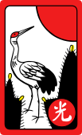
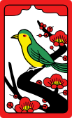

# 고스톱 Trainer



A browser-based **Go-Stop (고스톱)** card game trainer — rule-based AI opponent, animated scoring explanations, and full DE / EN / KO support. Runs entirely in the browser with no backend.

▶ **[Play it live](https://tscz.github.io/gostop)**

Press the **?** button in the top-right corner for in-app rules, scoring combinations, and special rules (available in EN / DE / KO).

---

## Getting started

```bash
npm install
npm run dev
```

Open [http://localhost:5173](http://localhost:5173).

## Scripts

| Command | Description |
|---------|-------------|
| `npm run dev` | Start dev server |
| `npm run build` | Type-check + production build |
| `npm run preview` | Preview production build locally |
| `npm test` | Run unit tests (Vitest) |

## Project structure

```
src/
├── core/               # Pure TypeScript game logic (no React)
├── store/              # Zustand global state
├── components/         # React UI components
├── i18n/               # Translation files (de.json, en.json, ko.json)
├── App.tsx
└── main.tsx
```

## Deployment

Pushing a GitHub Release triggers the `deploy-release.yml` workflow which builds and deploys to the `gh-pages` branch automatically. Every push runs the CI build via `build.yml`.

---

[](LICENSE)

Hwatu card artwork by **Marcus Richert**, based on Louie Mantia Jr.'s Hanafuda graphics.
Licensed under [CC BY-SA 4.0](https://creativecommons.org/licenses/by-sa/4.0/).
Source: [Wikimedia Commons – Category:SVG Hwatu](https://commons.wikimedia.org/wiki/Category:SVG_Hwatu)
